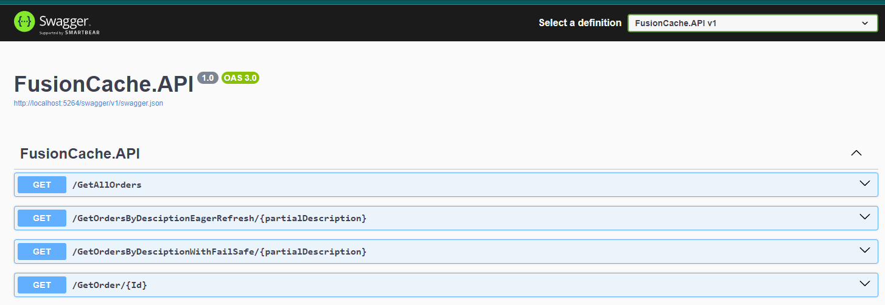

# Fusion Cache Playground

This repository serves as a playground for testing and experimenting with FusionCache, a highly efficient and versatile caching library for .NET.

FusionCache is an advanced hybrid cache that blends the benefits of `IMemoryCache` and `IDistributedCache`. While it shares similarities with the upcoming `HybridCache` in .NET 9, FusionCache distinguishes itself by offering a rich set of features designed to enhance the efficiency and resilience of your caching strategy.

## Key Features of FusionCache

- **Hybrid Cache Implementation**: FusionCache seamlessly integrates the speed of in-memory caching with the scalability of distributed caching, allowing developers to leverage both local and remote cache storage without complex configurations.

- **Cache Stampede Prevention**: FusionCache includes built-in mechanisms to prevent cache stampedes. This ensures that even under heavy load, the system remains performant by avoiding multiple simultaneous requests for the same data when it is not in the cache.

- **In-Memory Cache Synchronization**: FusionCache automatically synchronizes the in-memory cache across different instances using Redis notifications. This feature is particularly valuable in distributed environments, ensuring consistency across instances and reducing the risk of cache coherence issues.

- **Fail-Safe Mechanism**: When attempting to access expired data that is no longer in the cache, FusionCache provides a fail-safe option. If the retrieval of fresh data takes too long, FusionCache can fall back to the expired data, ensuring your application continues to function smoothly while fresh data is being fetched.

- **Adaptive Caching**: FusionCache allows dynamic adjustments to cache durations based on custom logic, such as the recency of data updates, enhancing cache efficiency and data relevance.

- **Eager Refresh**: FusionCache supports eager refresh, allowing you to update cached data before it expires. This operation occurs in the background, ensuring that fresh data is available when needed without interrupting ongoing operations.

For more detailed information, refer to the official FusionCache documentation:  
[Official Documentation](https://github.com/ZiggyCreatures/FusionCache)

## Project Structure

```plaintext
<project_root>/
 | - docker/
 | | - docker-compose.yaml
 | - src/
 | | - HybridCachePlayground.API/
 | | - HybridCache.sln
```

Inside the `docker` folder, you'll find a `docker-compose.yaml` file with services configured as follows:

- **Redis**: The latest Redis service.
- **Redis Insight**: A useful tool for monitoring Redis or Garnet Key Store Database.

The `src` folder contains a simple project for basic interactions with Garnet. Detailed explanations of the project will be provided in subsequent chapters.

Once you start the project, a Swagger page similar to this one will appear:




The core of this repository is in the `Domain` project, where I added a `SampleService` that uses `Bogus` to generate fake data.

Several sample methods for setting and caching data are provided to test some FusionCache features.
